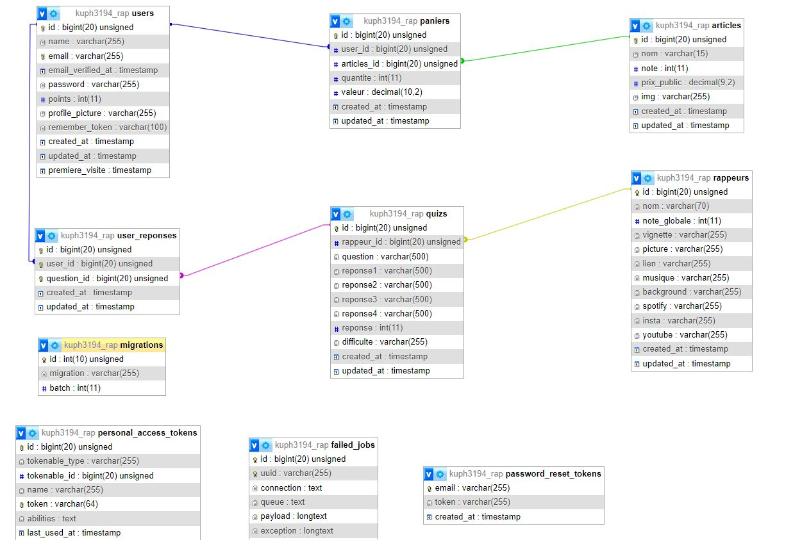
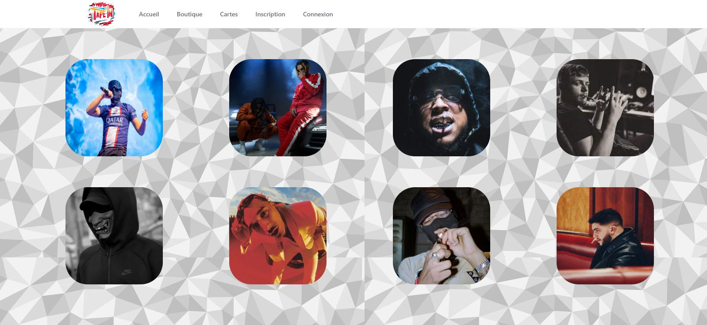
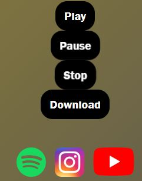
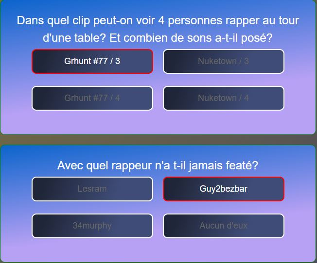
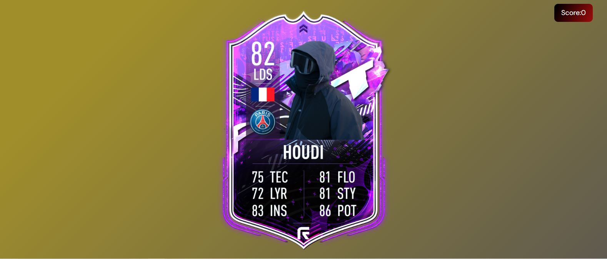
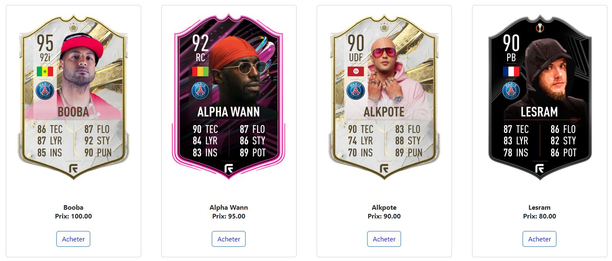
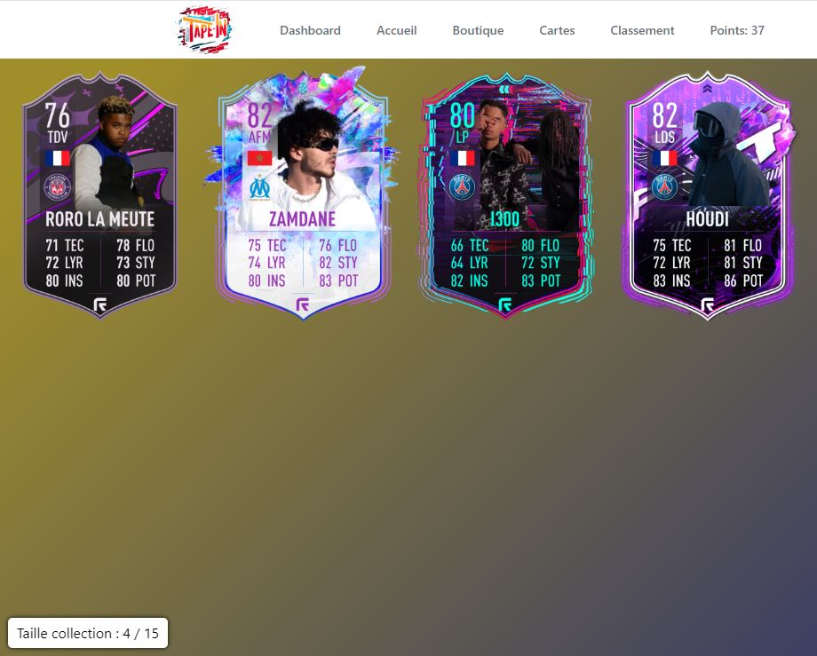
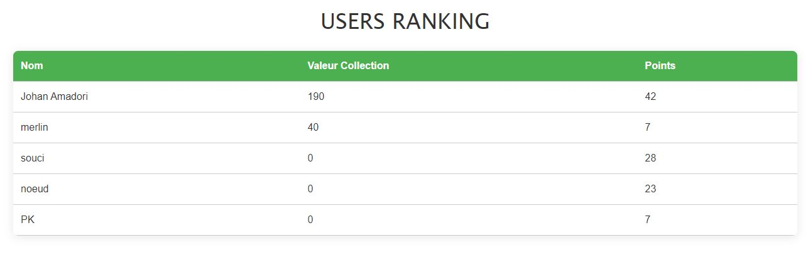
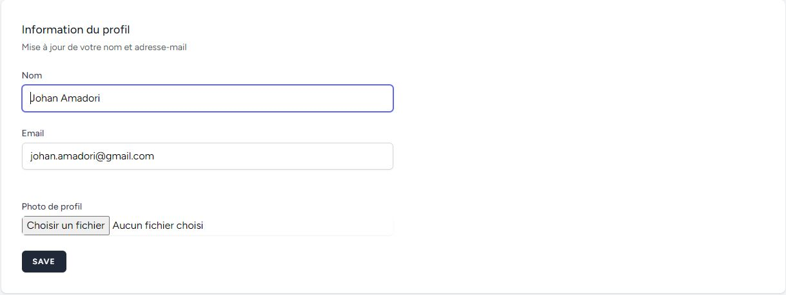
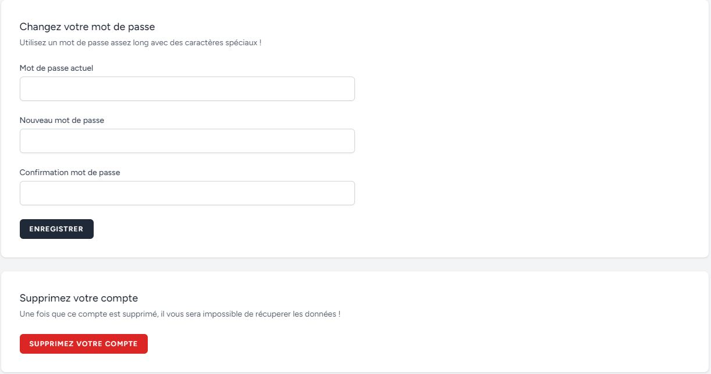

# Documentation du site rapTest

## Contexte et besoins

**rapTest** est un site développé en PHP avec le framework Laravel, il s'agit d'un site de quizs ayant comme thème la musique.

L'utilisateur devra pouvoir repondre à des quizs et acheter les articles de la Boutique, pour se faire un système de points users doit etre mis en place.

## Réalisations

### Base de données rapTest

Les tables sont créées avec des migrations.

**Migrations créées :**
- `users`
- `articles`
- `rappeurs`
- `quiz`
- `paniers`

### Outils du framework utilisés

- **Migrations** : pour ajouter des tables
- **Vues** : pour afficher les différentes pages
- **Controllers** : pour implémenter les fonctions
- **Models** : pour récupérer les colonnes utilisées pour chaque migration
- **Routes** : pour utiliser les fonctions des Controllers
- **Seeders** : pour remplir la base de données
- **Layouts** : pour ajouter un code a une page avec un simple "include" 
- **Providers**

### Fonctionnalités intégrées

**Authentification Utilisateur :**
- Connexion
- Inscription
- Suppression
- Modification de profil

**Quiz :**
- Création de l'interface
- Ajout de points aux utilisateurs en répondant aux quiz

**Musique :**
- Écouter/télécharger de la musique

**Boutique :**
- Création d'interface
- Achat d'articles

**Classement :**
- Affichage d'un classement des utilisateurs (trié par valeur)

**Attribution de bonus selon les actions de l'utilisateur**

## Contraintes

- Le design doit etre responsive
- Un guest doit pouvoir consulter le site
- Absolument tout doit etre stocké dans la BDD (images , mp3, liens)

## Mode d'emploi Utilisateur

**Page Accueil**

L'utilisateur peut répondre aux quizs personnalisés de chaque artistes, en les selectionnant dans la page "Accueil", cela le redirigera vers une page "Rappeur".

**Page Rappeur**

L'utilisateur peut télécharger la carte de l'artiste, ecouter sa musique et la télécharger. Il a également la possibilité de consulter ses réseaux sociaux.

Le quiz est disponible en dessous, incluant 5 questions sur la carrière de l'artiste.

Chaque réponse correcte lui attribura des points (2 en l'occurance).

Une carte rappeur avec un effet dynamique est integré, l'utilisateur peut la télécharger en cliquant dessus.

Avec les points engrangés par ces quizs, l'utilisateur pourra acheter des cartes de chaque artiste pour les rajouter a sa collection dans la page "Cartes".

**Page Boutique**

L'interface rescence toutes les cartes achetables ainsi que leur prix.
Lors de l'achat, des points bonus sont ajoutés a certaines conditions ( premiere carte achetée, carte d'une certaine note ..)  
Des messages d'erreurs peuvent etre affichés tel que l'impossibilité d'acheter si l'utilisateur n'a pas assez de points ou s'il n'est pas connecté.

**Page Cartes**

Dès qu'une carte est achetée, elle est ajouté ici, et sa valeur viendra s'ajouter à la valeur de votre collection définie dans la page "Classement"
Un compteur de cartes possédées y est inscrit.

**Page Classement**

Il a également la possibilité de consulter le classement des Utilisateurs pour connaitre la valeur de la collection et les points des autres Utilisateurs.

**Page Profil**

L'utilsateur a la possibilité de :

- Modifier l'adresse-mail enregistrée lors de l'inscription
- Modifier son nom/ mot de passe actuel
- Supprimer son compte définitivement

**Page Legal**

L'utilisateur peut consulter les CGU du site.
Accessible depuis le footer des pages.

